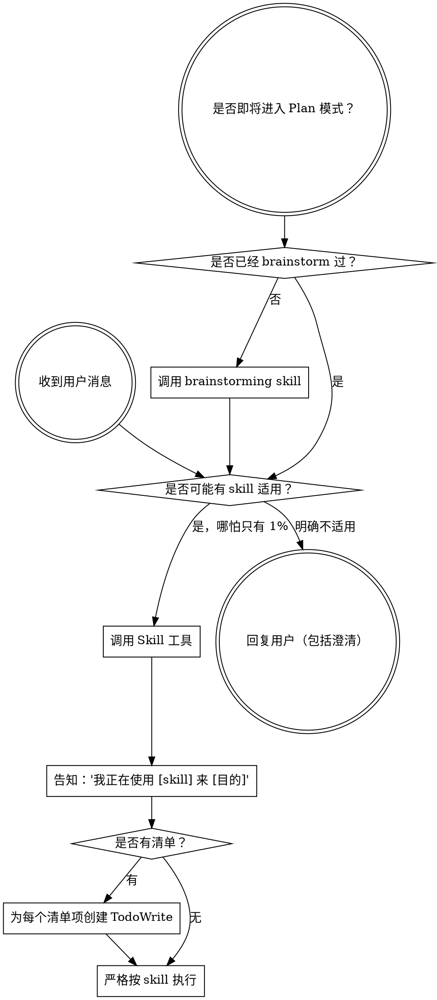

<SUBAGENT-STOP>
如果你是被派发来执行某个具体任务的子代理，请跳过本 skill。
</SUBAGENT-STOP>

<EXTREMELY-IMPORTANT>
只要你认为有哪怕 1% 的可能某个 skill 适用于当前任务，你就绝对必须调用该 skill。

如果有 skill 适用，你没有选择权。你必须使用它。

这不是协商项，也不是可选项。不要为跳过它找理由。
</EXTREMELY-IMPORTANT>

## 指令优先级

Superpowers skill 可以覆盖默认系统提示，但**用户指令永远优先**：

1. **用户的显式指令**（`CLAUDE.md`、`GEMINI.md`、`AGENTS.md`、直接请求）- 最高优先级
2. **Superpowers skills** - 在冲突时覆盖默认系统行为
3. **默认系统提示** - 最低优先级

如果 `CLAUDE.md`、`GEMINI.md` 或 `AGENTS.md` 说“不要用 TDD”，而某个 skill 说“必须始终用 TDD”，应遵从用户指令。用户拥有控制权。

## 如何访问 Skills

**在 Claude Code 中：** 使用 `Skill` 工具。调用后会加载并展示 skill 全文，直接遵循其中内容。不要用 `Read` 工具读取 skill 文件。

**在 Copilot CLI 中：** 使用 `skill` 工具。skill 会从已安装插件中自动发现，工作方式与 Claude Code 的 `Skill` 工具一致。

**在 Gemini CLI 中：** 通过 `activate_skill` 工具激活。Gemini 在会话启动时加载 metadata，需要时按需激活全文。

**在其他环境中：** 请查看对应平台文档，确认如何加载 skills。

## 平台适配

skill 文本默认使用 Claude Code 的工具名。非 Claude Code 平台请参见：

- `references/copilot-tools.md`
- `references/codex-tools.md`

Gemini CLI 用户会通过 `GEMINI.md` 自动加载工具映射。

# 使用 Skills

## 规则

**在任何回复或动作之前，先调用相关或被点名的 skill。** 只要有 1% 的可能适用，就应该先调用 skill 检查。  
如果调用后发现它并不适合当前情形，可以不继续使用。

## 红旗信号

出现下面这些念头时，说明你在给自己找借口，应该立刻停下：

| 想法                        | 现实                                         |
| --------------------------- | -------------------------------------------- |
| “这只是个简单问题”          | 问题也是任务。先查 skill。                   |
| “我得先补点上下文”          | skill 检查应该发生在澄清问题之前。           |
| “我先看看代码库再说”        | skill 会告诉你该如何探索。                   |
| “我先快速看一下 git / 文件” | 文件没有对话上下文。先查 skill。             |
| “我先收集点信息”            | skill 会告诉你如何收集。                     |
| “这不需要正式 skill”        | 只要已有 skill，就该用。                     |
| “我记得这个 skill 怎么用”   | skill 会演进。读当前版本。                   |
| “这不算任务”                | 只要要行动，就是任务。先查 skill。           |
| “这个 skill 太重了”         | 简单的事情也会变复杂。先用。                 |
| “我先做这一小步”            | 任何动作前都要先查。                         |
| “这样更高效”                | 无纪律的动作会浪费时间。skill 就是为防这个。 |
| “我知道这是什么意思”        | 懂概念不等于用了 skill。去调用它。           |

## Skill 优先级

当多个 skill 可能适用时，遵循这个顺序：

1. **流程型 skill 优先**（如 `brainstorming`、`systematic-debugging`）- 它们决定“怎么做”
2. **实施型 skill 其次**（如 `frontend-design`、`mcp-builder`）- 它们指导“做什么”

例如：

- “我们来构建 X” -> 先用 `brainstorming`
- “修这个 bug” -> 先用 `systematic-debugging`

## Skill 类型

**刚性 skill**（如 TDD、debugging）  
必须严格照做，不要自行改造掉纪律部分。

**柔性 skill**（如模式型 guidance）  
可以按上下文调整原则。

具体是哪一种，以 skill 自身说明为准。

## 用户指令

用户指令回答的是“做什么”，不是“怎么做”。  
“加一个功能”或“修一个问题”不等于可以跳过工作流。
